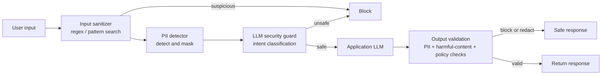

# 05 — Production Patterns

> **Numeric prefixes = suggested reading order** (increasing difficulty; files are independent). One soft dependency: `01_langsmith_setup.py` turns on the tracing that `02`–`05` all decorate with `@traceable`.

What has to exist around an agent before it faces real users: tracing, metrics, cost control, security, and automated evaluation.

## `01_langsmith_setup.py`

**What it does**
- Enables tracing with `LANGSMITH_TRACING=true`.
- Wraps functions in `@traceable(name=..., tags=[...])` so arbitrary Python — not just LCEL chains — shows up as a named run tree in LangSmith.
- Demonstrates naming runs and attaching metadata for later filtering.

**What it's for**
- Observability baseline — once tracing is on, every chain invocation, token count, latency and error is recorded without further code changes.

## `02_monitoring.py`

**What it does** — self-rolled telemetry:
- A `JSONFormatter` logging subclass emitting structured JSON logs (timestamp/level/module/function + `extra_data`) for log aggregators.
- A `MetricsCollector` tracking requests, errors, latency, token counts and cache hits, with derived error rate / avg latency / hit rate.
- An `InstrumentedLLM` wrapper combining timing, metrics recording, structured logging and `@traceable`.

**What it's for**
- The metrics you actually get paged on — p99 latency, error rate, token burn — in a form Datadog/CloudWatch can index.

## `03_cost_optimization.py`

**What it does** — three levers:
- `ModelRouter` classifies query complexity with a cheap model, then dispatches simple queries to gpt-4o-mini and complex ones to gpt-4o, returning an estimated cost.
- `SemanticCache` / `CachedLLM` hash-normalize queries for exact-match caching and report hit rate (with notes on the embedding-similarity version).
- `TokenBudget` / `BudgetedLLM` estimate tokens per request, reject over-budget calls, and accumulate usage stats.

**What it's for**
- Keeping the bill sane — most production traffic is repetitive and simple, so routing plus caching is usually a large cost cut before any prompt tuning.

## `04_security_patterns.py`

**What it does** — layered defense:
- `InputSanitizer` regex-matches prompt-injection phrasings ("ignore all previous instructions", "---END OF PROMPT---") and strips delimiter runs.
- `PIIDetector` finds/masks email, phone, SSN, credit card and IP with regex.
- `SecurityGuard` is the LLM-as-judge classifier returning `{"safe": bool, "reason": ...}`, failing closed on parse error.
- `OutputValidator` re-scans model output for leaked PII and harmful patterns.
- `SecurePipeline` chains all five steps around the actual LLM call.

**What it's for**
- Prompt injection, data exfiltration, and PII compliance.
- The checks that must run on both sides of the model, not just on input.

**Why the layers are ordered this way**
- Start with deterministic, cheap checks on every request: pattern search and regular
  expressions can flag common prompt-injection phrasing and detect/mask well-defined
  PII such as email addresses, phone numbers, SSNs, and card numbers.
- Use the LLM guard as a later, more flexible classification layer for intent that
  regexes cannot reliably recognize. It costs an API call, so early deterministic
  blocks avoid paying for it unnecessarily.
- Always validate the output too. Combine deterministic PII redaction and harmful-
  content checks with any policy-specific validation: a model can expose information
  from retrieved documents or earlier conversation even when the input was clean.

## `05_testing_patterns.py`

**What it does** — a testing ladder with four distinct jobs:
- **Unit tests** use a `Mock` LLM returning a canned `AIMessage`. They are fast,
  deterministic, and free; use them to verify your own prompt wiring, output
  parsing, error handling, and branching logic—not whether a model knows a fact.
- **Integration (live smoke) tests** call a real model to confirm credentials,
  provider compatibility, and a basic end-to-end path. Free-text answers should
  be checked against several acceptable phrases or other criteria, rather than a
  single exact string.
- **Evaluations** measure answer quality across a dataset. This example uses an
  LLM-as-judge for correctness, relevance, clarity, and completeness, alongside a
  deterministic keyword-overlap check.
- **Regression tests** re-run a fixed dataset after a prompt or model change and
  compare scores with a baseline, using agreed thresholds to decide whether the
  change is safe to release.

Second half is the production approach:
- LangSmith `Client` datasets (`create_dataset`/`create_example`).
- A `@traceable` target function.
- Custom evaluators (`correctness`, `helpfulness`, keyword-overlap `contains_answer`).
- `evaluate(..., experiment_prefix=...)` run twice with different prompts, so v1 vs v2 can be compared in the dashboard.

**What it's for**
- Knowing whether a prompt/model change made things better.
- Combining deterministic tests for application behavior with dataset-based
  evaluation for variable model behavior. Exact assertions still work well for
  structured outputs, schemas, tool calls, routing decisions, and safety rules.
